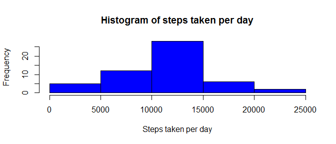
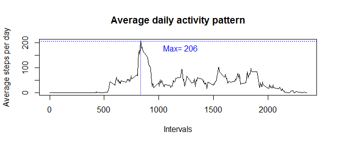
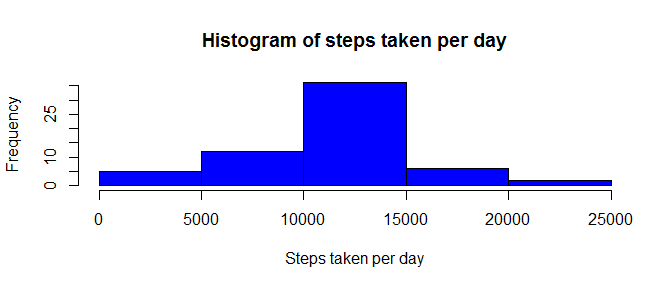

# Reproducible Research: Peer Assessment 1


## Loading and preprocessing the data


```r
setwd("c:/Users/Ola/Desktop/Coursera/Reproductible_research/Project1")
raw<-read.csv("activity.csv", header=T, na.strings="NA")
raw$Date <- as.Date(raw$date, format="%Y-%m-%d")
```

## What is mean total number of steps taken per day?

```r
#Reading the dplyr package 
library(dplyr)
```


```r
#and converting the dataset to dplyr dataframe.
data<-tbl_df(raw)

#Calculating the table summarizing the data by day
groupByDay<-group_by(data,Date)
summaryByDate<-summarize(groupByDay,StepsPerDay=sum(steps))

#Plotting the histogram
with(summaryByDate, hist(StepsPerDay, main="Histogram of steps taken per day",
                         col="blue", xlab="Steps taken per day"))
```

 

```r
#Calculating the mean and the median
meanNumberOfSteps<-round(mean(summaryByDate$StepsPerDay, na.rm=T),2)
medianNumberOfSteps<-round(median(summaryByDate$StepsPerDay, na.rm=T),2)
```

**Mean** number of steps taken per day is 1.076619\times 10^{4}. The **median** is almost the same and equals 1.0765\times 10^{4}.


## What is the average daily activity pattern?

```r
#Calculating the table summarizing the data by day
dataWoNa<-filter(data, is.na(steps)==FALSE)
groupByInterval<-group_by(dataWoNa,interval)
summaryByInterval<-summarize(groupByInterval,MeanIntervalByDay=mean(steps))
```

```r
with(summaryByInterval, plot(interval, MeanIntervalByDay, type="l", main="Average daily activity pattern", xlab="Intervals", ylab="Average steps per day"))

maxNumberOfSteps<-max(summaryByInterval$MeanIntervalByDay)
intervalWithMaxSteps<-as.integer(filter(summaryByInterval,MeanIntervalByDay==maxNumberOfSteps)[1])
maxAvgSteps<-as.integer(filter(summaryByInterval,MeanIntervalByDay==maxNumberOfSteps)[2])

abline(v=intervalWithMaxSteps, col="blue", lty=3)
abline(h=maxAvgSteps, col="blue", lty=3)
text(1200,180, paste("Max=" , maxAvgSteps), col="blue")
```

 

The interval which on average across all the days in the dataset, contains the maximum number of step is 835.


## Imputing missing values

```r
dataNa<-filter(data, is.na(steps)==TRUE)
naNumber<-as.integer(summarize(dataNa,  count = n())[1])
```
Number of missing values equals 2304.

```r
groupByInterval<-group_by(data,interval)
summaryByInterval<-summarize(groupByInterval,intervalAverage=mean(steps,na.rm=T))
dataAll <- merge(data, summaryByInterval, by.x="interval", by.y="interval")
dataAll<-mutate(dataAll, stepsInputted=ifelse(is.na(steps)==T,intervalAverage,steps))
```

```r
#converting the dataset to dplyr dataframe.
dataAll<-tbl_df(dataAll)

#Calculating the table summarizing the data by day
groupByDay<-group_by(dataAll,Date)
summaryByDate<-summarize(groupByDay,StepsPerDay=sum(stepsInputted))

#Plotting the histogram
with(summaryByDate, hist(StepsPerDay, main="Histogram of steps taken per day",
                         col="blue", xlab="Steps taken per day"))
```

 


```r
#Calculating the mean and the median
meanNumberOfSteps<-round(mean(summaryByDate$StepsPerDay),2)
medianNumberOfSteps<-round(median(summaryByDate$StepsPerDay),2)
```
**Mean** number of steps taken per day is 1.076619\times 10^{4}. The **median** is almost the same and equals 1.076619\times 10^{4}.


## Are there differences in activity patterns between weekdays and weekends?
